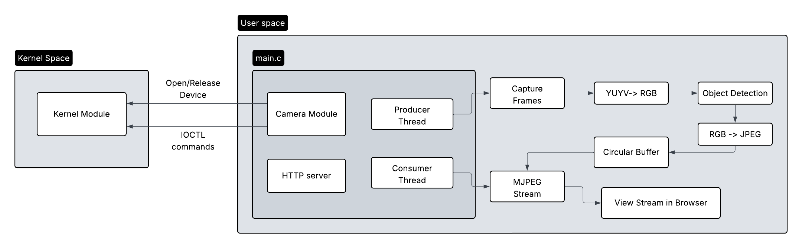

## 📸 Real-Time Embedded Linux Video Streaming System
A real-time camera streaming system built on a Raspberry Pi that integrates a custom Linux kernel module, a multithreaded user-space capture pipeline, image processing, and MJPEG HTTP streaming.

This project demonstrates end-to-end system design across kernel space and user space. It combines Linux interfaces (V4L2, IOCTL, MMAP) with concurrent data pipelines and computer vision inference.

#### 🌿 Branches 
- `main` - Stable, fully integrated version of the project
- `stream` - Core camera capture and MJPEG streaming pipeline
- `stream_detect` - Streaming pipeline with on-device object detection
- `gh-pages` - Generated documentation hosted via github pages
 
👉 Explore the generated docs: [Doxygen Documentation](https://hajjsalad.github.io/RaspberryPi-Cam-Streamer/html/index.html)      
👉 Explore how the documentation was structured and written: [Notes on Notion](https://www.notion.so/hajjsalad/Doxygen-Documentation-2dea741b5aab809989afdaf9d198430b).  
👉 Each key feature includes a link to in-depth implementation notes that describe how the module was designed and built.   
👉 This repository contains the backend implementation. The Android frontend is maintained in a separate repository: [Android Frontend repo](https://github.com/HajjSalad/RaspberryPi-Android-Video-Streaming)

#### 🗝️ System Components
The backend is organized into five core components:     
- 🔌 **Kernel Device Driver**
    - Character device driver exposing camera control and LED status signaling via `ioctl`
    - Well-defined kernel ↔ user-space interface with minimal surface area       
- 📸 **V4L2 Camera Pipeline**
    - Camera configuration using V4L2 API, including format negotiation and stream parameters
    - Buffer allocation and zero-copy frame access via memory mapping I/O (MMAP)
    - Continuous frame capture with explicit buffer dequeue and re-queue operations       
- 🔄 **Multithreaded Producer-Consumer Pipeline**
    - Dedicated producer thread captures frames from the camera pipeline
    - Consumer thread streams encoded frames to connected HTTP clients
    - Lock-protected circular buffer ensure safe, low-latency data exchange between threads 
- 🖼️ **Image Processing Pipeline** 
    - Multi-stage processing: YUYV422 → RGB24 color space conversion (BT.601) and JPEG compression (libjpeg)
    - Motion detection via frame differencing (SAD), 
    - TensorFlow Lite object detection (MobileNet-SSD)    
- 📡 **MJPEG HTTP Streaming** 
    - Lightweight TCP-based HTTP server bound to port 8080
    - Handling client connections, routing requests via request manager
    - Delivering continuous MJPEG streams using multipart/x-mixed-replace protocol   

--- 
### 🔌 Custom Linux Kernel Module
[Notes on Notion](https://www.notion.so/hajjsalad/Cam-Stream-Kernel-Module-2cca741b5aab80e1bddbe204e5e99eae)   
- Character device driver exposing camera control and LED status signaling via `ioctl`
- Well-defined kernel ↔ user-space interface with minimal surface area
- GPIO-driven LED indicators reflecting real-time camera streaming state

`GPIO` · `IOCTL` · `Character device` · `Linux kernel` · `kernel ↔ user space interface`

---
### 📸 V4L2-Based Camera Pipeline
[Notes on Notion](https://www.notion.so/hajjsalad/V4L2-Streaming-Pipeline-2cca741b5aab80be8b30e62d9311b929)

- Camera configuration using V4L2 API, including format negotiation and stream parameters
- Buffer allocation and zero-copy frame access via memory mapping I/O (MMAP)
- Continuous frame capture with explicit buffer dequeue and re-queue operations   

`V4L2` · `Camera drivers` · `MMAP` · `Buffer management` · `Video streaming`

---
### 🔄 Multithreaded Producer-Consumer Architecture
- Producer Thread
  - Continously capture frames from the camera using V4L2
  - Converts raw frames to JPEG and pushes them into a circular buffer
  - Signals frame availability using a semaphore
- Consumer Thread
  - Waits on the semaphore for available frames
  - Retrieves JPEG frames from the circular buffer
  - Streams JPEG frames to connected HTTP clients   
  - Frees the memory of the processed frames
  
This design allows for **producer thread** to run continously, while a new **consumer thread** is spawned per client.

`Mutex` · `Semaphore` · `Circular buffers` · `Multithreading` · `Producer-consumer model`

---
### 🖼️ Image Processing Pipeline
[Notes on Notion](https://www.notion.so/hajjsalad/Object-Detection-2d2a741b5aab80ac958fc72ffb4de8a4)
- Performs on-device inference using TensorFlow Lite on captured frames
- Optimized for real-time edge deployment on the Raspberry Pi    

`Edge AI` · `Object Detection` · `Embedded ML` · `TensorFlow Lite` · `Real-time Inference`. 

---
### 📡 MJPEG HTTP Streaming
[Notes on Notion](https://www.notion.so/hajjsalad/MJPEG-HTTP-Streaming-2cca741b5aab80d9ab6beddf8d86db00)

- Lightweight HTTP server for serving video streams
- Multipart MJPEG streaming compatible with web browsers and MJPEG clients     

`HTTP` · `MJPEG` · `Sockets` · `Lightweight server` · `Multipart streams`

---

### 🏗️ High Level Flow
   

#### Program Flow Explanation
```
main.c (Program Entry Point)
├─> Initialize camera module (opens custom kernel module)
├─> Start HTTP server for MJPEG streaming
└─> Initialize threading pipeline

Producer Thread
├─> Capture frames from the camera (YUYV format)
├─> Convert YUYV → RGB
├─> Optional: Perform object detection on RGB frames
├─> Convert RGB → JPEG
└─> Push JPEG frames into circular buffer

Consumer Thread
├─> Retrieve JPEG frames from circular buffer
└─> Stream frames over HTTP (MJPEG)

├─> Display stream in browser   
```
---
### ⚙️ Hardware
- **Raspberry Pi 5** - primary embedded platform for kernel and user-space execution
- **Logitech C270 USB webcam** - V4L2-compatible video capture device
- **GPIO-connected RGB LED** - real-time system status indication
  - RED: idle state or error condition
  - GREEN: active camera streaming

### 🧱 Build and Run
- `make module`: Build the kernel module  
- `make user`: Build the user-space application  
- `make`: Build both the kernel module & user-space application  
- `sudo insmod kernel/cam_stream.ko`: Insert the kernel module  
- `sudo ./camera_client`: Start the camera streaming application  
- `http://<raspberry-pi-ip>/stream`: Open broswer and view the stream  

### 📂 Repository Structure
```
📁 pi_live_stream/
│
├── docs/                     # Doxygen-generated documentation
│
├── kernel/                   # Linux kernel module
│   ├── cam_stream.c          # Character device + ioctl implementation
│   ├── cam_stream_ioctl.h    # Shared ioctl interface (kernel ↔ user)
│   └── Makefile              # Kernel module build rules
│
├── src/                      # User-space application
│   ├── camera/               # V4L2 camera capture & buffer management
│   │   ├── camera.c
│   │   └── camera.h
│   │
│   ├── cb/                   # Lock-protected circular buffer
│   │   ├── circular_buffer.c
│   │   └── circular_buffer.h
│   │
│   ├── detection/            # Real-time object detection (TFLite)
│   │   ├── detection.cpp
│   │   ├── detection.h
│   │   └── models/
│   │       └── detect.tflite
│   │
│   ├── http/                 # HTTP server + MJPEG streaming
│   │   ├── http_server.c
│   │   ├── http_server.h
│   │   ├── mjpeg_stream.c
│   │   └── mjpeg_stream.h
│   │
│   ├── image/                # Image processing & encoding
│   │   ├── image_encoder.c
│   │   ├── image_encoder.h
│   │   ├── image_processor.c
│   │   └── image_processor.h
│   │
│   └── main.c                # Application entry point & thread orchestration
│
├── README.md                 # Project overview & usage
└── Makefile                  # Builds kernel module and user-space client
```
